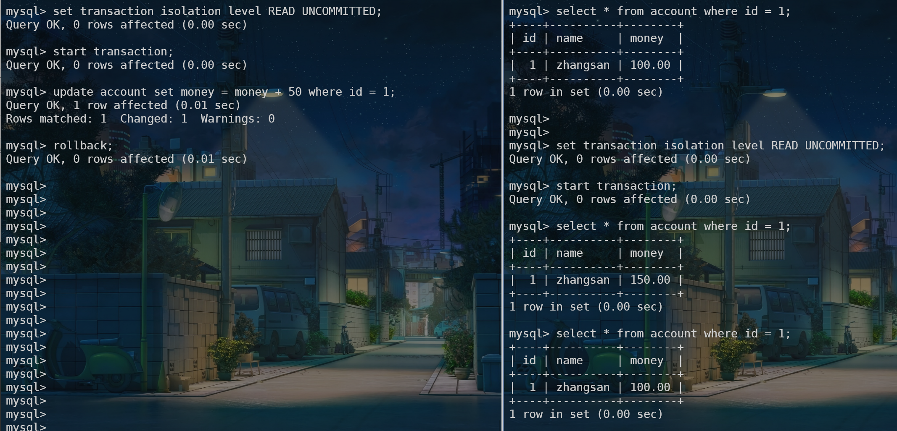
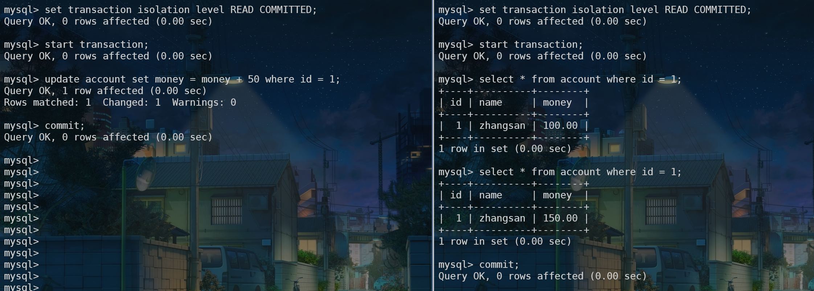
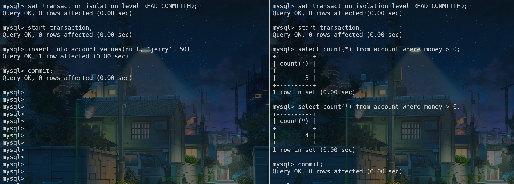

# 事务

第一次接触到数据库”事务“这个词好像是在大学的时候的课本上，那时候对此没什么概念，很好奇为什么叫这个名字。然后结合它的原名 "transaction" 以及那个经典的银行转账的案例，就比较好理解了。

:::tip
题外话：学习技术很多时候还是要跳出中文环境，大多数的英文技术文档翻译过来反而不如原版好理解，甚至给人误导。
:::

在 MySQL 中，所谓的事务就是指将一组数据库的操作视作一个独立的单元，要么全部执行成功，要么全部执行失败，通常一个事务对应着业务上的一个操作场景，比如张三向李四转账，其中包含对张三的账户扣款、对李四的账户增加存款等过程，但对于转账这个事务来说，不可能存在张三的钱扣了，但是李四的账户没到账的中间态。可以说事务保证了数据的一致性。

MySQL事务具有 ACID 这 4 个特性：

- A(Atomic): 原子性，整个事务是一个不可分割的工作单元。
- C(Consistent): 一致性，事务执行完成后，所有数据的状态是一致的。要么全部成功，要么失败回滚。
- I(isolation): 隔离性，多个事务之间对数据的操作是隔离的（4 种隔离级别）。
- D(Durability): 持久性，一旦事务提交成功，对数据的修改就会永久保存到数据库中。

## 基本语法

- 开启事务

```sql
begin;
// 或者 start transaction;
```

- 提交事务

事务中通常包含多条 SQL 语句，需要手动 commit 才能把对数据的修改保存在数据库中，如果提交失败，也就意味着整个事务失败了，所作更改不会应用到数据库中。

```sql
commit;
```

- 回滚

有时候，我们会根据实际业务代码报错等异常情况手动使用 rollback 回滚事务，也标志着事务为失败，所有对数据的更新操作都会回滚到之前的状态。

```sql
rollback;
```

:::tip
对于单条 SQL 语句，MySQL 默认会把它当做一个事物处理，称为隐式事务。可通过 `show variables like 'autocommit';` 看到默认是开启状态。
:::

注意事项：

MySQL 事务的语法虽然简单，但是它背后的事情可不简单，并且它是一项比较耗资源和比较危险的功能，不能滥用，否则会出现你意想不到的事情。我曾见过有些程序猿在项目中三条语句走天下，不管三七二十一先开启事务，中间包裹那又臭又长的代码，在 catch 中回滚，很暴力，也产生过事故。所以使用时要注意：

- 事务尽可能地短、紧凑，尽量不要把无关的业务逻辑放在其中。
- 查询数据通常不需要使用事务。
- 要控制好事务的及时结束，避免死锁。
- 如果在事务中执行了 DDL 语句(create / drop / alter)、lock tables 语句等，会马上触发执行 commit 提交事务。

## 多事务并发问题及四种隔离级别

对于并发执行的事务，如果涉及到对相同数据的访问和修改，那么有可能会产生数据不一致的问题，主要有：

- 脏读：一个事务中读取到了另一个事物未提交的数据。

  

- 不可重读：在一个事务中先后两次读取同一个数据得到的结果不同。脏读与不可重复读的区别是前者读到的是其他事务未提交的数据，后者读到的是其他事务已提交的数据。

  

- 幻读：在一个事务中按照相同的条件先后两次查询得到的结果条数不同。不可重复读与幻读的区别是前者数据变化了，后者数据条数变化了。

  

MySQL 提供了四种隔离级别，避免此类情况带来的问题：

- 读未提交（Read uncommitted）
  - 其他事务可以读到未提交事务中的更改。
  - 本级别会出现的问题是脏读。
- 读已提交（Read Committed）
  - 其他事务只能读到事务中已提交的变更。
  - 本级别会出现的问题是不可重复读，交叉执行的多个事务有更新并 commit，导致了数据的变更。
- 可重复读（Repeatable Read）
  - 这是 MySQL （InnoDB 引擎）的默认隔离级别。
  - 它保证了同一个事务中读到的数据是相同的（即使在其他事务中有 update）。
  - 本级别存在的问题是幻读，当用户读取某一范围的数据行时，另一个事务又在该范围内插入了新行，当用户再读取该范围的数据行时，会发现有新的“幻影” 行。
  - MySQL 中的可重复读解决了幻读。
- 串行化（Serializable）
  - 最严格的隔离级别。所有事务按照次序依次执行，因此，脏读、不可重复读、幻读都不会出现。
  - 严重影响性能，平时一般不会使用此级别。

| 隔离级别 | 脏读 | 不可重复读 | 幻读 |
| -------- | ---- | ---------- | ---- |
| 读未提交 | Y    | Y          | Y    |
| 读已提交 | N    | Y          | Y    |
| 可重复读 | N    | N          | Y    |
| 串行化   | N    | N          | N    |


:::tip
MySQL InnoDB 默认的隔离级别为可重复读。可通过 `SHOW VARIABLES LIKE 'tx_isolation';` 查看。

隔离级别越高，系统性能开销越大，可支持的并发越少。
:::

## MVCC（Multi-Version Concurrency Control）


<Vssue />
