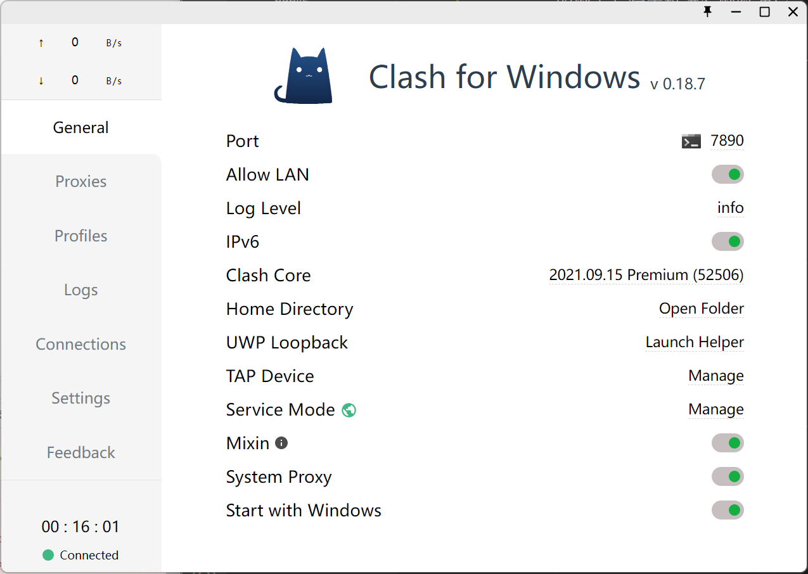
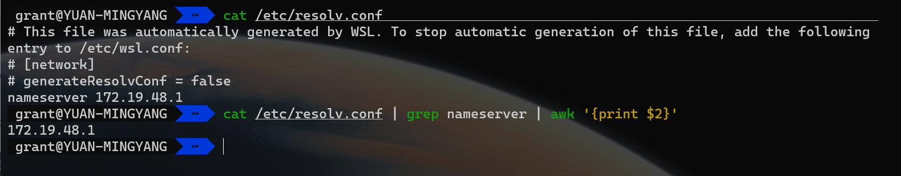
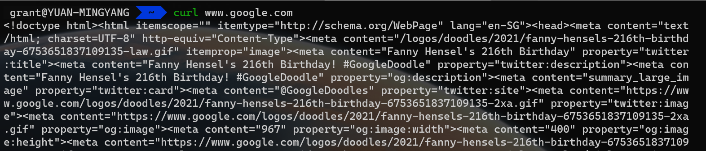

# 工具

## 科学冲浪

之前一直用 SS + ，感觉很久没有人维护了，自带的转发规则也不是很好用。后来发现了 Clash 这个工具，功能强大，颜值高，支持多平台。

[Clash](https://docs.cfw.lbyczf.com/)

[Github仓库](https://github.com/Dreamacro/clash)



配置 WSL2 终端网络走代理：

WSL2 使用了 Hyper-V 技术，可以理解为子系统相当于与宿主机在同一局域网下的一台独立的主机，它通过一张虚拟的网卡与宿主机进行网络通信，所以与宿主机不共享 localhost。我们的代理通常是运行在 Windows 系统中的，想让子系统也被代理，主要步骤如下：

- 代理允许局域网内的设备连接（Allow LAN）。
- 找到 Windows 的 ip。
- 设置代理

### 获取主机 ip

WSL2 每次启动时会在 /etc/resolv.con 中生成主机的 ip 作为域名解析。可以通过以下命令获取该地址：

```sh
cat /etc/resolv.conf | grep nameserver | awk '{print $2}'
```


### 设置代理

在终端中执行：

```sh
export ALL_PROXY="http://172.19.48.1:7890"
```

由于这个 ip 在每次重启后都会变化，所以可以稍作优化，将以下代码加入终端配置(~/.zshrc)中：

```sh
# clash proxy
host_ip=$(cat /etc/resolv.conf | grep "nameserver" | awk '{print $2})
export ALL_PROXY="http://$host_ip:7890"
```

这样每次启动终端时就会自动设置代理。

:::tip
如果无法连接这个代理 ip，有可能是 Windows 防火墙的问题。

以管理员身份在 PowerShell 中执行以下命令：

```sh
New-NetFirewallRule -DisplayName "WSL" -Direction Inbound -InterfaceAlias "vEthernet (WSL)" -Action Allow
```

[参考](https://github.com/microsoft/WSL/issues/4585)
:::

### 验证

访问谷歌能够返回响应数据即成功。



<Vssue />
